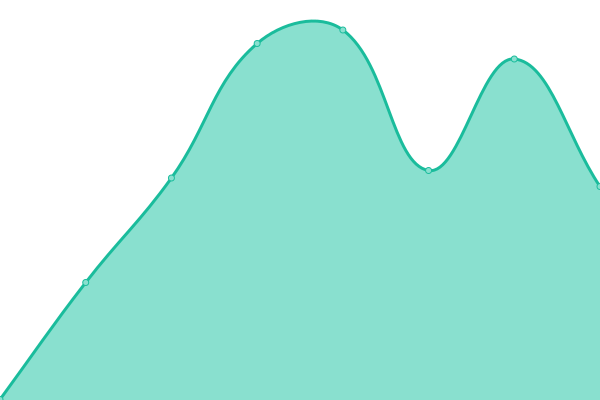

# [📈 Live Status](https://status.voltflx.com): <!--live status--> **🟧 Partial outage**

This repository contains the open-source uptime monitor and status page for [LukeHjo](https://dev.lukehjo.tech), powered by [Upptime](https://github.com/upptime/upptime).

With [Upptime](https://upptime.js.org), you can get your own unlimited and free uptime monitor and status page, powered entirely by a GitHub repository. We use [Issues](https://github.com/luke-beep/status.voltflx.com/issues) as incident reports, [Actions](https://github.com/luke-beep/status.voltflx.com/actions) as uptime monitors, and [Pages](https://status.voltflx.com) for the status page.

<!--start: status pages-->
<!-- This summary is generated by Upptime (https://github.com/upptime/upptime) -->
<!-- Do not edit this manually, your changes will be overwritten -->
<!-- prettier-ignore -->
| URL | Status | History | Response Time | Uptime |
| --- | ------ | ------- | ------------- | ------ |
|  [VOLTFLX](https://voltflx.com) | 🟩 Up | [voltflx.yml](https://github.com/luke-beep/status.voltflx.com/commits/HEAD/history/voltflx.yml) | 

 407ms
     
 | 

<a href="https://status.voltflx.com/history/voltflx">100.00%</a>
    

|  [VoltFLX support](https://support.voltflx.com) | 🟥 Down | [volt-flx-support.yml](https://github.com/luke-beep/status.voltflx.com/commits/HEAD/history/volt-flx-support.yml) | 

 0ms
     
 | 

<a href="https://status.voltflx.com/history/volt-flx-support">0.00%</a>
    

|  [VoltFLX discord](https://discord.voltflx.com) | 🟥 Down | [volt-flx-discord.yml](https://github.com/luke-beep/status.voltflx.com/commits/HEAD/history/volt-flx-discord.yml) | 

 0ms
     
 | 

<a href="https://status.voltflx.com/history/volt-flx-discord">0.00%</a>
    

<!--end: status pages-->

[**Visit our status website →**](https://status.voltflx.com)

## 📄 License

- Powered by: [Upptime](https://github.com/upptime/upptime)
- Code: [MIT](./LICENSE) © [LukeHjo](https://dev.lukehjo.tech)
- Data in the `./history` directory: [Open Database License](https://opendatacommons.org/licenses/odbl/1-0/)
